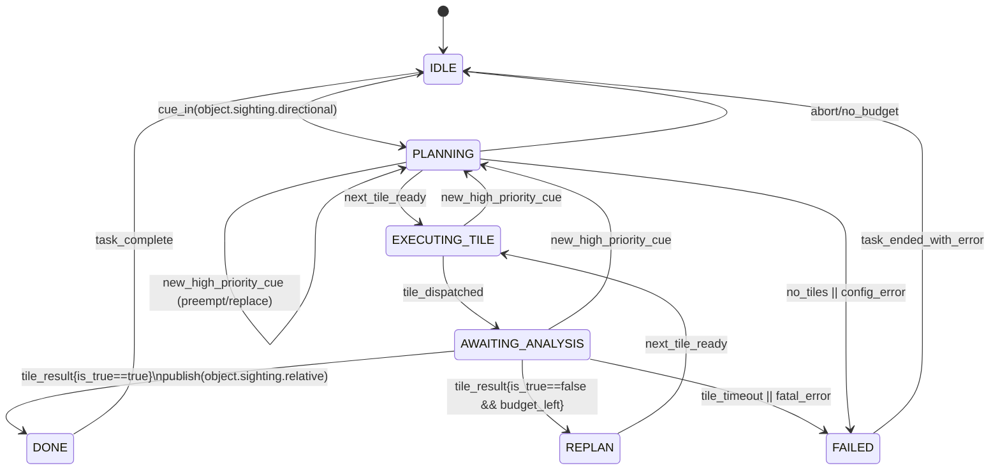

# Search Planner — State Machine

**Purpose:** This document defines how the Search Planner plugin behaves at runtime. It is the authoritative reference for states, transitions, events, timeouts, artifacts, and preemption rules.

**Scope:** The planner orchestrates “where to look next” for a modality (vision/radar), **waits** for that modality’s analyzer to return a decision for each tile, and stops immediately on the first confirmed detection. All angles are **relative to bow = 0°**. This planner **does not** emit NMEA nor vendor-specific messages.

## Mermaid Diagram

## State Definitions

* **IDLE**
  Waiting for a cue. No active task.

* **PLANNING**
  Build/refresh tiles from the cue (bearing ± error), current context, and selected pattern (manual by default; learning policy may recommend in shadow mode). Validate budgets/limits.

* **EXECUTING\_TILE**
  Dispatch a single tile to the Modality Adapter (move/knobs). Respect kinematics, capability bounds, and settle time.

* **AWAITING\_ANALYSIS**
  Block on the analyzer’s verdict for that tile (true/false) with a hard SLA timeout. The adapter returns an optional artifact (e.g., vision JPEG, radar heatmap).

* **REPLAN**
  Incorporate negative information, possibly adjust pattern/parameters, then select the next tile.

* **DONE**
  A tile returned `is_true == true`. Publish a normalized `object.sighting.relative` event then end the task.

* **FAILED**
  No tiles or config error, budget exhausted without a detection, or fatal adapter/analyzer error. Log and end the task.

## Events & Data Flow

* **Input cue (external):** `object.sighting.directional`
  *Fields:* bearing\_deg, sigma\_deg, source\_type, confidence, context (e.g., day/night, ducting flag).

* **Tile dispatch (internal):** `search.command`
  *Fields:* task\_id, tile {az\_deg, el\_deg, dwell\_ms, params}, knobs\_allowed.

* **Analyzer result (internal):** `search.tile_result`
  *Fields:* task\_id, tile\_id, is\_true, score, meta, artifact\_path? (JPEG/PNG optional).

* **Confirmed sighting (external):** `object.sighting.relative`
  *Fields:* bearing, distance (or `range_is_synthetic` + method), confidence (0–100), error bounds, context.
  *Note:* This plugin **only** publishes the normalized event; a different component formats NMEA.

## Timeouts & Guardrails

* **Per-tile SLA:** dwell + settle + analyzer SLA (configurable). On timeout:

  * Count and log the timeout.
  * REPLAN (optionally retry the tile once) or mark FAILED if policy requires.

* **Global budgets:** time\_budget\_ms and max\_tiles enforced strictly.

* **Capability bounds:** Only adjust knobs advertised by the modality (e.g., Vision: `zoom`; Radar: `power/gain/clutter`). Clamp to bounds provided by the adapter.

* **Motion hygiene:** Avoid thrash—limit large slews per second; use zoom hysteresis.

## Preemption

A new high-priority cue **interrupts** the current task from any of PLANNING, EXECUTING\_TILE, or AWAITING\_ANALYSIS. The planner cancels the current task, cleans up, and restarts PLANNING with the new cue. Duplicate publishes are forbidden.

## Artifacts

* **Vision:** Capture a JPEG during the dwell; provide path as `artifact_path`.
* **Radar:** If available, render/attach a small PNG (scope/heatmap). If not, provide detection metadata only.

Artifacts are for operator review and offline training; they are optional for non-vision modalities.

## Learning (Optional, Shadow Mode)

The learning policy (contextual bandit) **recommends** a pattern + params but does not control the camera until it has proven (offline, via logs) that it beats the manual policy. The planner logs per-tile context, recommendation, and outcomes for later evaluation.

## Source of Truth

* This document governs state/transition behavior.
* `plugins/search_planner/plugin.py` contains the ASCII diagram and must remain aligned with this file.
* The test plan (`docs/SEARCH_PLANNER_TESTPLAN.md`) validates these behaviors.
