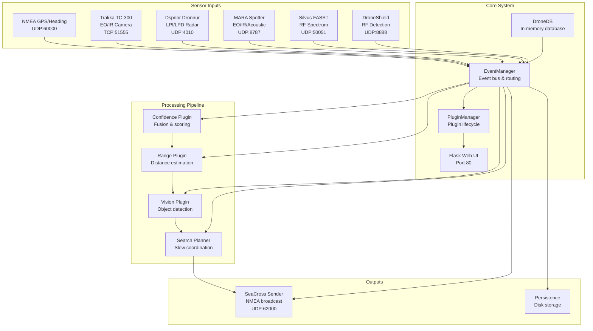
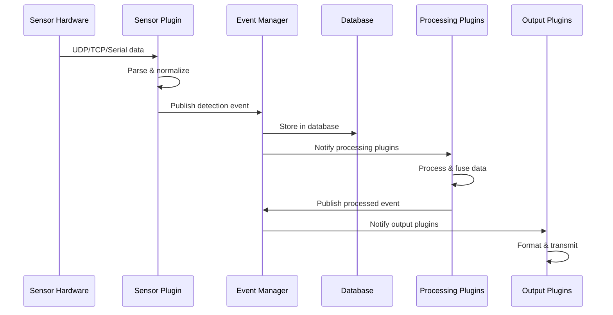

# TheBox Service Topology

## System Architecture Overview

TheBox is a modular drone detection system with a plugin-based architecture. The core system consists of:

- **Core Services**: Database, Event Manager, Plugin Manager
- **Sensor Plugins**: UDP listeners for various sensors
- **Processing Plugins**: Confidence, Range, Vision, Search
- **Output Plugins**: SeaCross sender, persistence

## Service Dependencies

## Data Flow Architecture

## Network Ports

| Service | Port | Protocol | Purpose |
|---------|------|----------|---------|
| DroneShield | 8888 | UDP | RF detection data |
| Silvus FASST | 50051 | UDP | RF spectrum/AoA data |
| MARA Spotter | 8787 | UDP | EO/IR/Acoustic data |
| Dspnor Dronnur | 4010 | UDP | LPI/LPD radar data |
| Trakka TC-300 | 51555 | TCP | EO/IR camera control |
| NMEA GPS/Heading | 60000 | UDP | GPS position & heading |
| SeaCross Output | 62000 | UDP | NMEA broadcast |
| Web UI | 80 | HTTP | Operator interface |

## Plugin Communication Events

### Core Events
- `detection` - Raw sensor detection
- `object.sighting.directional` - Bearing-only detection
- `object.sighting.relative` - Bearing + range detection
- `object.classification` - Object type/affiliation
- `search.slew` - Camera slew command
- `seacross_announcement` - SeaCross output

### Event Flow
1. **Sensor Plugins** → `detection` events
2. **Confidence Plugin** → processes detections → `object.classification`
3. **Range Plugin** → estimates distance → `object.sighting.relative`
4. **Vision Plugin** → visual confirmation → enhanced detections
5. **Search Planner** → coordinates camera → `search.slew`
6. **SeaCross Sender** → formats NMEA → UDP broadcast

## Bearing Normalization

All bearings are normalized to **bow-relative** (0° = bow direction):
- Global offset: `BOW_ZERO_DEG` environment variable
- Plugin-specific offsets: `{PLUGIN}_BEARING_OFFSET_DEG`
- Final bearing = sensor_bearing + global_offset + plugin_offset
- Normalized to [0, 360) degrees

## Safety & Degradation

- **Fail-open**: Missing sensors don't crash system
- **Graceful degradation**: System continues with available sensors
- **Timeout handling**: All UDP listeners have configurable timeouts
- **Reconnection**: Automatic reconnection with exponential backoff
- **Health monitoring**: `/status` endpoint reports plugin health
