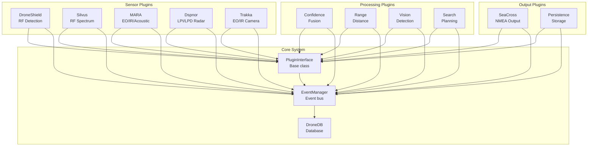
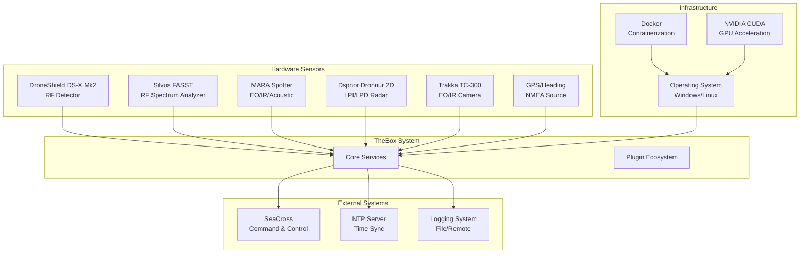

# TheBox Dependency Graph

## Python Dependencies

```mermaid
graph TB
    subgraph "Core Dependencies"
        FLASK[Flask 2.0+<br/>Web framework]
        PYDANTIC[Pydantic 2.6+<br/>Data validation]
        STRUCTLOG[Structlog 23.0+<br/>Structured logging]
        TENACITY[Tenacity 8.0+<br/>Retry logic]
        DOTENV[python-dotenv 1.0+<br/>Environment loading]
    end

    subgraph "Sensor Communication"
        PYSERIAL[pyserial-asyncio 0.6+<br/>Serial communication]
        SOCKET[socket<br/>UDP/TCP networking]
        ASYNCIO[asyncio<br/>Async I/O]
    end

    subgraph "Data Processing"
        NUMPY[numpy<br/>Numerical computing]
        PANDAS[pandas<br/>Data analysis]
        SCIPY[scipy<br/>Scientific computing]
    end

    subgraph "Vision/AI (Optional)"
        ONNX[onnxruntime<br/>ML inference]
        OPENCV[opencv-python<br/>Computer vision]
        PIL[Pillow<br/>Image processing]
    end

    subgraph "Geospatial"
        PYPROJ[pyproj<br/>Coordinate transforms]
        GEOPY[geopy<br/>Geographic calculations]
    end

    subgraph "Testing & Development"
        PYTEST[pytest 7.0+<br/>Testing framework]
        BLACK[black<br/>Code formatting]
        RUFF[ruff<br/>Linting]
        MYPY[mypy<br/>Type checking]
    end

    %% Core dependencies
    FLASK --> PYDANTIC
    FLASK --> STRUCTLOG
    PYDANTIC --> DOTENV
    STRUCTLOG --> TENACITY

    %% Sensor plugins
    PYSERIAL --> ASYNCIO
    SOCKET --> ASYNCIO

    %% Data processing
    NUMPY --> PANDAS
    PANDAS --> SCIPY

    %% Vision pipeline
    ONNX --> OPENCV
    OPENCV --> PIL

    %% Geospatial
    PYPROJ --> GEOPY
```

## Plugin Dependencies

## External System Dependencies

## Version Constraints

### Python Version
- **Minimum**: Python 3.10
- **Recommended**: Python 3.11 or 3.12
- **Jetson**: Python 3.10 (L4T compatibility)

### Critical Dependencies
- **Flask**: >=2.0.0 (security updates)
- **Pydantic**: >=2.6.0 (breaking changes in v2)
- **Structlog**: >=23.0.0 (structured logging)
- **Tenacity**: >=8.0.0 (retry logic)

### Optional Dependencies
- **ONNX Runtime**: For GPU acceleration on Windows/Jetson
- **OpenCV**: For vision processing
- **PySerial**: For serial communication
- **PyProj**: For coordinate transformations

### Platform-Specific
- **Windows**: CUDA support for ONNX Runtime
- **Jetson**: L4T-compatible packages
- **Linux**: Standard Python packages

## Dependency Management

### Requirements Files
- `requirements.txt` - Core dependencies
- `requirements-dev.txt` - Development tools
- `requirements-gpu.txt` - GPU acceleration
- `requirements-jetson.txt` - Jetson-specific

### Lock Files
- `poetry.lock` - Poetry lock file (if using Poetry)
- `pip-tools` - For pip-compile generated requirements

### Environment Isolation
- Virtual environments for development
- Docker containers for deployment
- Conda environments for Jetson
